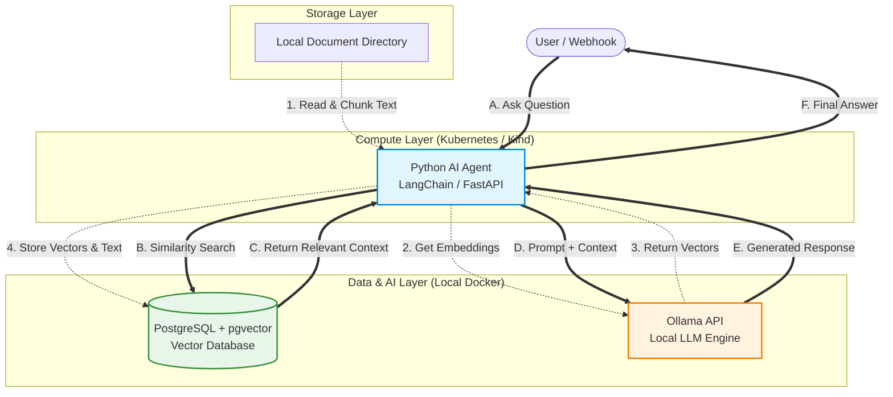

```mermaid
graph TD
    %% Styling definitions
    classDef compute fill:#e1f5fe,stroke:#0288d1,stroke-width:2px;
    classDef database fill:#e8f5e9,stroke:#388e3c,stroke-width:2px;
    classDef ai fill:#fff3e0,stroke:#f57c00,stroke-width:2px;

    User([User / Webhook])

    subgraph "Compute Layer (Kubernetes / Kind)"
        App[Python AI Agent <br/> LangChain / FastAPI]:::compute
    end

    subgraph "Data & AI Layer (Local Docker)"
        DB[(PostgreSQL + pgvector <br/> Vector Database)]:::database
        LLM[Ollama API <br/> Local LLM Engine]:::ai
    end

    subgraph "Storage Layer"
        Docs[Local Document Directory]
    end

    %% Data Ingestion Flow (Dotted Lines)
    Docs -.-> |1. Read & Chunk Text| App
    App -.-> |2. Get Embeddings| LLM
    LLM -.-> |3. Return Vectors| App
    App -.-> |4. Store Vectors & Text| DB

    %% Inference Flow (Solid Lines)
    User ==> |A. Ask Question| App
    App ==> |B. Similarity Search| DB
    DB ==> |C. Return Relevant Context| App
    App ==> |D. Prompt + Context| LLM
    LLM ==> |E. Generated Response| App
    App ==> |F. Final Answer| User
```