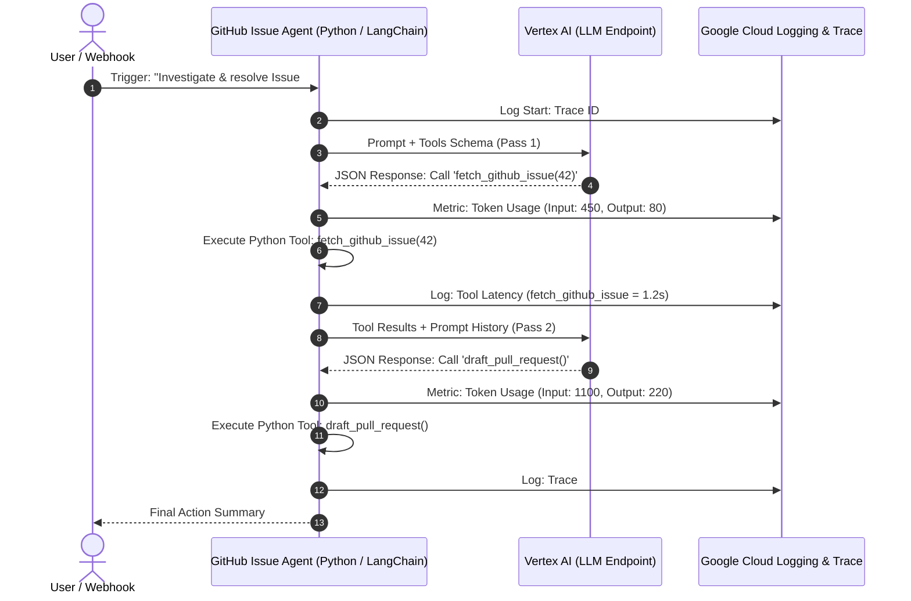

# Week 4: Enterprise Guardrails, VPC-SC, and MLOps Governance

**Goal:** Transition local AI prototypes into a hardened GCP cloud architecture protected by VPC Service Controls and Workload Identity.

## 🛠️ Architecture & Components

1. **Perimeter Defense (VPC-SC):**
   * Provisioned Terraform manifests for `google_access_context_manager_service_perimeter`.
   * Ring-fenced `aiplatform.googleapis.com` (Vertex AI) and `sqladmin.googleapis.com` (AlloyDB) to prevent unauthorized API access and data exfiltration.

2. **Identity & Least Privilege:**
   * Configured GKE Workload Identity Federation to eliminate static IAM service account keys.

## 💡 Architect Key Takeaway
Running AI in an enterprise requires treating model endpoints (`aiplatform.googleapis.com`) with the same perimeter security and network boundaries as database instances.

## Core Security Pillars for Enterprise AI
1. Perimeter Security (VPC Service Controls)
Goal: Create an isolated security perimeter around Vertex AI, AlloyDB/Cloud SQL, and Cloud Storage buckets.

Mechanism: Blocks API requests originating outside the perimeter—even with valid IAM credentials—preventing sensitive enterprise embeddings or prompts from being exfiltrated to unauthorized networks.

2. Identity & Access Governance (Least Privilege & Workload Identity)
Goal: Eliminate static service account keys in code repositories.

Mechanism: Bind GKE Kubernetes Service Accounts (KSA) directly to GCP Identity and Access Management (IAM) Service Accounts using Workload Identity Federation.

3. MLOps Telemetry & Auditability
Goal: Maintain total visibility over AI Agent decision-making loops and API consumption.

Mechanism: Capture prompt tokens, tool execution latency, and reasoning traces using Cloud Logging, Cloud Trace, and OpenTelemetry.

4. Data Protection & Model Guardrails
Goal: Protect vectors at rest and shield against prompt injection attacks.

Mechanism: Enforce Customer-Managed Encryption Keys (CMEK) on vector storage and implement input/output sanitization filters before feeding text to the LLM.

---
If you want a deeper dive into the perimeter security aspect, [Protect your resources with VPC Service Controls](https://www.youtube.com/watch?v=TD06WkY1zLs) is a great visual breakdown from Google Cloud Tech. This video is relevant because it clearly explains how to define fine-grained perimeter security around cloud resources and data within VPC networks to prevent data exfiltration.
http://googleusercontent.com/youtube_content/1

# Phase 4 Architecture: Enterprise Security & Observability

This document details the core technical patterns required to transition local AI agent prototypes into a production-grade, hardened Google Cloud Platform (GCP) architecture.

---

## 1. Option A: MLOps Telemetry & Observability

### Technical Overview
Standard software applications are **deterministic** (input $A$ always yields output $B$). Autonomous AI Agents are **non-deterministic**—they make dynamic decisions in real-time based on LLM inference loops.

To safely operate an AI Agent in enterprise production, we must implement **telemetry and tracing** to capture three primary metrics:
* **Token Consumption:** LLM APIs charge based on input/output tokens. Tracking token count per request is mandatory for cost attribution and quota management.
* **Tool Execution Latency:** Monitoring how long individual `@tool` functions take to execute (e.g., querying vector stores, fetching GitHub APIs).
* **Reasoning Traces:** Capturing the step-by-step logic chain (ReAct loop) to audit why an agent chose a specific tool or generated a given payload.

### Telemetry Sequence Diagram

