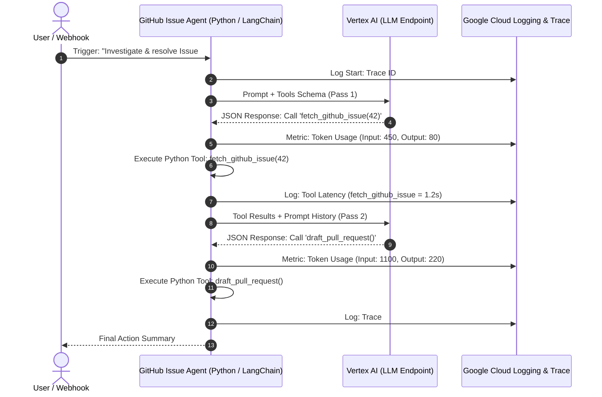
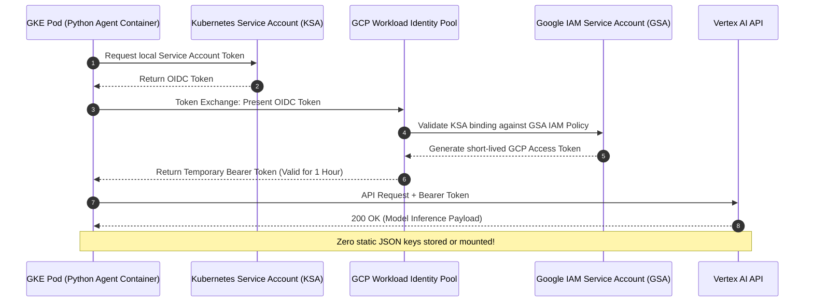

# Week 4: Enterprise Guardrails, VPC-SC, and MLOps Governance

**Goal:** Transition local AI prototypes into a hardened GCP cloud architecture protected by VPC Service Controls and Workload Identity.

## 🛠️ Architecture & Components

1. **Perimeter Defense (VPC-SC):**
   * Provisioned Terraform manifests for `google_access_context_manager_service_perimeter`.
   * Ring-fenced `aiplatform.googleapis.com` (Vertex AI) and `sqladmin.googleapis.com` (AlloyDB) to prevent unauthorized API access and data exfiltration.

2. **Identity & Least Privilege:**
   * Configured GKE Workload Identity Federation to eliminate static IAM service account keys.

## 💡 Architect Key Takeaway
Running AI in an enterprise requires treating model endpoints (`aiplatform.googleapis.com`) with the same perimeter security and network boundaries as database instances.

## Core Security Pillars for Enterprise AI
1. Perimeter Security (VPC Service Controls)
Goal: Create an isolated security perimeter around Vertex AI, AlloyDB/Cloud SQL, and Cloud Storage buckets.

Mechanism: Blocks API requests originating outside the perimeter—even with valid IAM credentials—preventing sensitive enterprise embeddings or prompts from being exfiltrated to unauthorized networks.

2. Identity & Access Governance (Least Privilege & Workload Identity)
Goal: Eliminate static service account keys in code repositories.

Mechanism: Bind GKE Kubernetes Service Accounts (KSA) directly to GCP Identity and Access Management (IAM) Service Accounts using Workload Identity Federation.

3. MLOps Telemetry & Auditability
Goal: Maintain total visibility over AI Agent decision-making loops and API consumption.

Mechanism: Capture prompt tokens, tool execution latency, and reasoning traces using Cloud Logging, Cloud Trace, and OpenTelemetry.

4. Data Protection & Model Guardrails
Goal: Protect vectors at rest and shield against prompt injection attacks.

Mechanism: Enforce Customer-Managed Encryption Keys (CMEK) on vector storage and implement input/output sanitization filters before feeding text to the LLM.

---
If you want a deeper dive into the perimeter security aspect, [Protect your resources with VPC Service Controls](https://www.youtube.com/watch?v=TD06WkY1zLs) is a great visual breakdown from Google Cloud Tech. This video is relevant because it clearly explains how to define fine-grained perimeter security around cloud resources and data within VPC networks to prevent data exfiltration.
http://googleusercontent.com/youtube_content/1

# Phase 4 Architecture: Enterprise Security & Observability

This document details the core technical patterns required to transition local AI agent prototypes into a production-grade, hardened Google Cloud Platform (GCP) architecture.

---

## 1. Option A: MLOps Telemetry & Observability

### Technical Overview
Standard software applications are **deterministic** (input $A$ always yields output $B$). Autonomous AI Agents are **non-deterministic**—they make dynamic decisions in real-time based on LLM inference loops.

To safely operate an AI Agent in enterprise production, we must implement **telemetry and tracing** to capture three primary metrics:
* **Token Consumption:** LLM APIs charge based on input/output tokens. Tracking token count per request is mandatory for cost attribution and quota management.
* **Tool Execution Latency:** Monitoring how long individual `@tool` functions take to execute (e.g., querying vector stores, fetching GitHub APIs).
* **Reasoning Traces:** Capturing the step-by-step logic chain (ReAct loop) to audit why an agent chose a specific tool or generated a given payload.

### Telemetry Sequence Diagram



## 2 Option B: Workload Identity Federation (Zero-Trust Security)

### Technical Overview
In Google Kubernetes Engine (GKE), containers need permission to call GCP APIs (such as Vertex AI for model inference or Cloud SQL/AlloyDB for vector search).

### The Legacy (Insecure) Anti-Pattern:
Generating a static Google IAM Service Account JSON key, storing it as a Kubernetes Secret, and mounting it into the container.

* **Risk:** Static keys can be leaked, committed to source control, or extracted if a pod is compromised.

### The Workload Identity (Enterprise) Pattern:
Workload Identity eliminates static credentials by establishing a trust relationship between Kubernetes Service Accounts (KSA) and Google Cloud IAM Service Accounts (GSA).

* 1. A Kubernetes Pod runs under a specific KSA.

* 2. When calling GCP services, the pod exchanges its short-lived Kubernetes token for a temporary GCP OAuth2 Access Token via the Workload Identity Pool.

* 3. Tokens automatically expire after 1 hour, enforcing Least Privilege and zero static credential footprint.

### Workload Identity Sequence Diagram



## 🛠️ Step-by-Step Implementation Guide

### Option A: Implementing MLOps Telemetry

**1. Install Dependencies**
```powershell
pip install google-cloud-logging
```
**2. Create the Telemetry Interceptor**
Created agents/github-issue-agent/telemetry.py to stream logs without hardcoding them into the tools:
```
import time
from langchain_core.callbacks import BaseCallbackHandler
from google.cloud import logging as gcp_logging

class MLOpsTelemetryHandler(BaseCallbackHandler):
    def __init__(self, trace_id: str):
        self.trace_id = trace_id
        self.tool_start_times = {}
        try:
            client = gcp_logging.Client()
            self.logger = client.logger("ai-agent-telemetry")
            self.use_gcp = True
        except Exception:
            self.use_gcp = False

    def log_event(self, event_name: str, payload: dict):
        payload["trace_id"] = self.trace_id
        if self.use_gcp:
            self.logger.log_struct(payload, severity="INFO")
        else:
            print(f"\n[TELEMETRY] {event_name.upper()} | {payload}")

    def on_llm_start(self, serialized: dict, prompts: list, **kwargs):
        self.log_event("llm_start", {"action": "Reasoning Loop Started", "model": serialized.get("name")})

    def on_tool_start(self, serialized: dict, input_str: str, **kwargs):
        tool_name = serialized.get("name", "unknown_tool")
        self.tool_start_times[tool_name] = time.time()
        self.log_event("tool_start", {"action": "Tool Executed", "tool_name": tool_name})

    def on_tool_end(self, output: str, name: str, **kwargs):
        latency = round(time.time() - self.tool_start_times.get(name, time.time()), 3)
        self.log_event("tool_end", {"action": "Tool Completed", "tool_name": name, "latency_seconds": latency})
```
**3. Wire the Interceptor to the Agent**
```
Updated agents/github-issue-agent/agent.py to use the callback:

from telemetry import MLOpsTelemetryHandler
import uuid

# Inside run_autonomous_agent():
run_trace_id = f"trace-{uuid.uuid4().hex[:8]}"
telemetry = MLOpsTelemetryHandler(trace_id=run_trace_id)

llm = ChatOllama(
    model="llama3.1",
    base_url="http://localhost:11434",
    temperature=0,
    callbacks=[telemetry] # Activates the telemetry wiretap
)
```
### Option B: Implementing Workload Identity (GKE)
**1. Infrastructure as Code (GCP Side)**
```
Created infrastructure/gcp-security/workload_identity.tf to establish trust:

resource "google_service_account" "ai_agent_gsa" {
  account_id   = "github-issue-agent-sa"
  display_name = "GitHub Issue Agent Service Account"
}

resource "google_project_iam_member" "agent_vertex_ai_user" {
  project = var.project_id
  role    = "roles/aiplatform.user"
  member  = "serviceAccount:${google_service_account.ai_agent_gsa.email}"
}

# Bind the Kubernetes Service Account to the Google Service Account
resource "google_service_account_iam_binding" "workload_identity_binding" {
  service_account_id = google_service_account.ai_agent_gsa.name
  role               = "roles/iam.workloadIdentityUser"
  members = [
    "serviceAccount:${var.project_id}.svc.id.goog[platform-agents/ai-agent-ksa]"
  ]
}

resource "google_service_account" "ai_agent_gsa" {
  account_id   = "github-issue-agent-sa"
  display_name = "GitHub Issue Agent Service Account"
}

resource "google_project_iam_member" "agent_vertex_ai_user" {
  project = var.project_id
  role    = "roles/aiplatform.user"
  member  = "serviceAccount:${google_service_account.ai_agent_gsa.email}"
}

# Bind the Kubernetes Service Account to the Google Service Account
resource "google_service_account_iam_binding" "workload_identity_binding" {
  service_account_id = google_service_account.ai_agent_gsa.name
  role               = "roles/iam.workloadIdentityUser"
  members = [
    "serviceAccount:${var.project_id}.svc.id.goog[platform-agents/ai-agent-ksa]"
  ]
}
```
**2. Kubernetes Manifest (Cluster Side)**
```
Created infrastructure/k8s-manifests/ai-agent-sa.yaml to annotate the KSA:

apiVersion: v1
kind: ServiceAccount
metadata:
  name: ai-agent-ksa
  namespace: platform-agents
  annotations:
    iam.gke.io/gcp-service-account: "github-issue-agent-sa@YOUR_PROJECT_ID.iam.gserviceaccount.com"
```
**3. Agent Pod Deployment**
```
Attached the secure KSA to the agent deployment:

apiVersion: apps/v1
kind: Deployment
metadata:
  name: github-issue-agent
  namespace: platform-agents
spec:
  template:
    spec:
      serviceAccountName: ai-agent-ksa # Zero-Trust Security Enabled
      containers:
      - name: agent
        image: your-registry/github-issue-agent:latest

```
## Key Takeaways for Architecture Reviews
```
| Pillar | Focus Area | Core Benefit |
| :--- | :--- | :--- |
| **MLOps Telemetry** | Observability & Cost | Streams token counts, tool execution latency, and agent decision paths directly to Cloud Logging and Trace. |
| **Workload Identity** | IAM Security | Eliminates static Service Account JSON keys by dynamically binding Kubernetes pods to GCP IAM roles. |
```

<!-- Load Mermaid rendering engine for GitHub Pages -->
<script type="module">
  import mermaid from 'https://cdn.jsdelivr.net/npm/mermaid@10/dist/mermaid.esm.min.mjs';
  mermaid.initialize({ startOnLoad: true });

  // Convert GitHub Pages code blocks into Mermaid divs
  document.addEventListener("DOMContentLoaded", function() {
    document.querySelectorAll('code.language-mermaid').forEach(el => {
      const div = document.createElement('div');
      div.className = 'mermaid';
      div.textContent = el.textContent;
      el.parentElement.replaceWith(div);
    });
  });
</script>
```
 