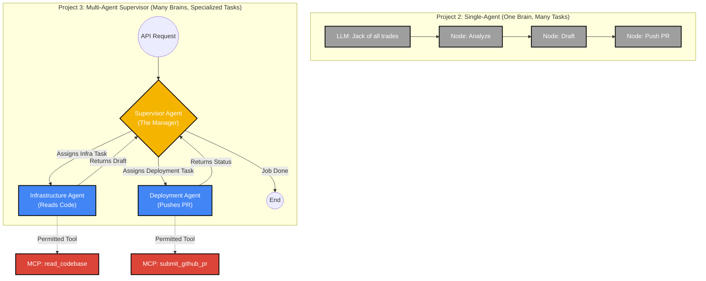

## Phase_1: Multi-Agent Supervisor (The Intelligence Path)

Expanding a single agent into a delegated swarm is the defining characteristic of modern enterprise AI. It pushes the boundaries of autonomous AI agents and perfectly mirrors the distributed traffic routing concepts you would typically manage with an Istio ingress gateway on a Kubernetes cluster. Instead of routing HTTP requests to microservices, you are routing cognitive tasks to specialized LLMs.

Here is why this is the strategic next step, and how it sets up the other two paths:

It Solves the Context Limit: Right now, your single agent holds the entire system prompt, all tools, and all memory. As enterprise use cases grow, that context window gets bloated and the LLM gets confused. A Supervisor pattern isolates responsibilities.

It Enables Granular Security: By separating agents, you can attach specific MCP tools only to the agents that need them. A "Code Reviewer" agent gets read-only access, while the "DevOps Agent" gets the GitHub push credentials.

It Prepares for Observability: A multi-agent flow generates fascinating, complex decision trees. Once this is built, wrapping it in enterprise IT monitoring tools like Dynatrace or LangSmith becomes highly valuable because you actually have inter-agent traffic and delegation hand-offs to observe.

***

### 🏗️ Project 3 Blueprint: The LangGraph Supervisor
We will architect a system with three distinct entities:

1. **The Supervisor (The Router):** Receives the initial GitHub issue, evaluates the requirement, and decides which sub-agent needs to act next. It acts purely as a LangGraph conditional edge.

2.  **The Infrastructure Engineer (Sub-Agent A)**: Armed only with the read_codebase MCP tool. Its sole job is to analyze Terraform files and draft code.

3.  **The Deployment Specialist (Sub-Agent B):** Armed only with the submit_github_pr tool. Its job is to take the drafted code, format it for a pull request, and push it to the repo.

This completely transforms your graph.py file from a simple linear sequence into a cyclical, intelligent graph where agents converse and hand off state.

***

#### Single AI agent LangGraph "Node" vs multi AI agent.

That is a brilliant catch, and it is exactly where most engineers get tripped up when moving from basic LangChain to advanced LangGraph.

The confusion stems from the word "Node."

In Project 2 (Single-Agent), a LangGraph "Node" was just a standard Python function (e.g., analyze_issue, draft_code). You had one brain (Llama 3.1) executing a linear checklist of tasks.

In a Multi-Agent architecture, the definition of a "Node" completely changes. A Node is no longer just a function; a Node becomes a completely independent AI Agent, with its own unique system prompt, its own isolated tools, and its own decision-making loop.

Let’s zoom in specifically on the "Reasoning Engine" and look at how a Single-Agent transforms into a Multi-Agent Supervisor.

#### 🧠 The Evolution of the Reasoning Engine

#### 🔍 How Multi-Agent Routing Actually Works
Instead of forcing one LLM to memorize how to be a DevOps engineer, a Security Reviewer, and a GitHub admin all at once, we split the cognitive load:

The Supervisor Agent (The Router): This LLM does absolutely no coding. Its only job is to read the GitHub issue, look at the available sub-agents, and decide who should speak next. It routes the conversation.

The Infrastructure Agent (The Coder): This LLM is given a strict system prompt ("You are a Terraform expert"). We give it access to the read_codebase MCP tool. It cannot talk to GitHub even if it wants to, because we don't give it that tool.

The Deployment Agent (The Operator): This LLM is given a strict system prompt ("You manage pull requests"). It is given the submit_github_pr MCP tool. It cannot read the codebase directly; it relies on the Infrastructure agent to hand it the drafted code.

#### The Workflow in Action:
The Supervisor asks the Infrastructure Agent to write the fix. The Infrastructure Agent uses its tool, drafts the code, and passes it back to the Supervisor. The Supervisor says, "Great, now Deployment Agent, push this to GitHub." The Deployment Agent uses its tool, pushes the PR, and reports back. The Supervisor sees both tasks are done and ends the workflow.

This pattern is highly resilient, scalable, and much easier to debug because each agent has a single, isolated responsibility.
